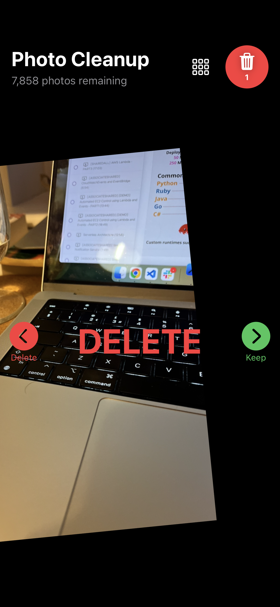

# Swipe Photo Delete

A SwiftUI iOS app for quickly reviewing and deleting photos from your photo library using intuitive swipe gestures.

## Features

- **Swipe Left**: Mark photo for deletion
- **Swipe Right**: Keep photo
- **Batch Deletion**: Photos are deleted in batches when the user confirms
- **Progress Tracking**: See how many photos remain and how many you've deleted
- **Full Photo Access**: Requires full photo library access to manage your images

## Installation

1. Clone the repository
2. Open `swipe-photo-delete.xcodeproj` in Xcode
3. Build and run on your iOS device or simulator

### License

This project is open source and available for personal use.
